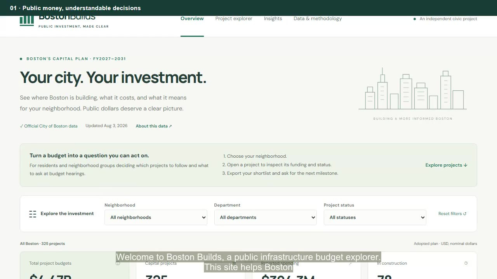

# Five-minute narrated site walkthrough

[Back to the README](../README.md) · [Watch or download the MP4](https://raw.githubusercontent.com/harrrisw/mit-1.125-ps1/main/docs/demo/boston-builds-walkthrough.mp4) · [Public site](https://boston-builds-budget-explorer.harris2004-wang.chatgpt.site/)

**Duration:** 5:00. **Format:** 1280 × 720 MP4, with narration and burned-in English captions. [Download WebVTT captions](demo/boston-builds-captions.vtt).

This is a recorded browser walkthrough of the same site build used for the public deployment. It demonstrates real filter selections, a project dialog, neighborhood comparisons, and CSV export. Narration uses the synthetic Microsoft Zira voice; it is not a recording of the project author. Caption timings are generated automatically. Figures describe the September 22, 2026 snapshot, not live construction progress.

If GitHub displays a file preview instead of a player, use the MP4 link above to open or download the video.

## Chapters and transcript

### 00:00–00:35 · Public money, understandable decisions

Welcome to Boston Builds, a public infrastructure budget explorer. This site helps Boston residents and neighborhood groups understand planned investments and decide which questions to bring to budget hearings. Instead of reading a long budget document, you can move from citywide totals to a particular project, compare neighborhoods, and download the underlying records. This demonstration follows that journey. The central question is not simply how much money is listed. It is which investment to follow, who is responsible, and what information residents should ask for next.

### 00:35–01:15 · Read the budget in context

The overview contains three hundred twenty five project records from Boston's adopted fiscal twenty twenty seven through twenty thirty one capital plan. Their lifetime budgets total about four point four seven billion dollars. Reported spending is about three hundred ninety four million dollars through fiscal twenty twenty five, and seventy eight records are labeled in construction. These indicators measure different things. A lifetime budget is not money already spent, and published status is not a live construction inspection. The notice below the indicators also flags a discrepancy: the City's summary lists three hundred twenty one projects, while the downloaded table contains three hundred twenty five.

### 01:15–02:05 · Explore a neighborhood

Now I select Dorchester in the neighborhood filter. The dashboard updates to twenty five projects with about one hundred eighty four million dollars in lifetime budgets. Department bars show how that selected investment is divided. The map highlights the source neighborhood, and selecting another mapped neighborhood would change the same filter. This map does not identify exact construction sites. The budget table has neighborhood labels but no street addresses or coordinates. Citywide and multi neighborhood projects are retained in the overall totals, but are not spread across the polygons. Below the map, the status chart shows project stages, and the funding chart separates City capital, other City funds, grants, and external funds. These controls help narrow a question without hiding what each measure means.

### 02:05–03:00 · Open a real project and export the evidence

Next, I reset the filters and search for project identifier C C C two five one six five. This opens the Grove Hall Community Center record assigned to Dorchester. Its published scope is to design and construct a new community center based on a programming study. The record lists a sixty five million dollar lifetime budget, about three point two million dollars spent through fiscal twenty twenty five, and an in construction status. It also identifies the owning and managing departments and breaks down the funding. These details support a precise question: what is the next construction milestone, and when will residents receive an update? They do not establish a completion date. Closing the details and exporting the filtered C S V gives residents a record they can use in a meeting or examine in a spreadsheet.

### 03:00–03:45 · Compare without overclaiming

The comparison panel places two neighborhoods side by side. Here, Roxbury has about three hundred fifty seven million dollars in listed project budgets, compared with about one hundred eighty four million for Dorchester. I can change the first selection to East Boston and see its totals alongside Dorchester. These comparisons use the complete snapshot, independently of dashboard filters. They are not adjusted for population, asset condition, or resident need. Crucially, about half of all budgets belong to citywide or multi neighborhood records. A larger local total therefore does not prove a neighborhood receives a fairer share or better services. The comparison is a starting point for asking who benefits, not a ranking of neighborhood equity.

### 03:45–04:25 · Findings that lead to practical questions

The findings lead to three oversight priorities. Schools and Public Works hold about fifty four percent of lifetime budgets. Ask for quarterly cost and milestone updates on their largest projects. About fifty point five percent of investment spans the city or multiple neighborhoods. Request service areas and beneficiary information before comparing local shares. Finally, sixty projects totaling about five hundred fifty three million dollars are labeled new project or to be scheduled. Ask for a named owner, next decision date, and engagement opportunity. These labels support questions, not a conclusion that projects are delayed.

### 04:25–05:00 · Sources, limits, and the next step

The methodology links official sources, dates, definitions, and known inconsistencies. Missing addresses, completion evidence, and outcome measures limit what we can conclude. The GitHub repository includes the collected C S V, a one page methodology note, and a reflection. The public site works on phones and computers. Choose a neighborhood, inspect a project, and export a shortlist. Boston Builds makes public investment easier to examine while keeping uncertainty visible. Follow the accompanying links to explore the site and repository.
